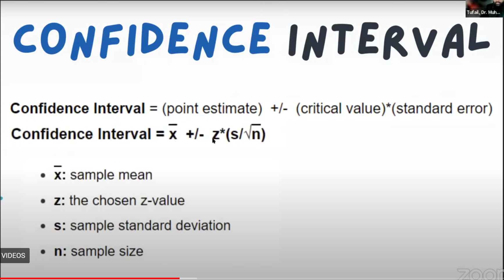

# Inferential Statistics

## Confidence Interval

## Hypothesis Testing

### Testing our null hypothesis 

## Test and their Types

### Steps
If p < 0.5 -> null hypothesis rejected\
If p > 0.5 -> null hypothesis accepted

Step 1:

If p < 0.5 -> data is not normal\
If p > 0.5 -> normal\

Step 2:

If p < 0.5 -> data is not Homogeneitical\
If p > 0.5 -> Homogeneitical

Step 3:

Types of purpose

