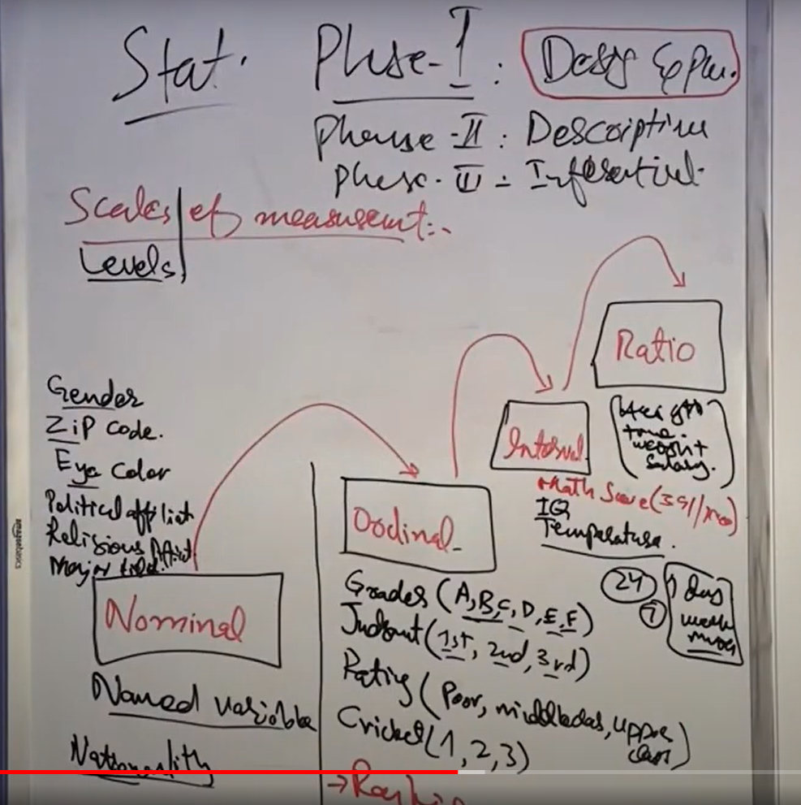
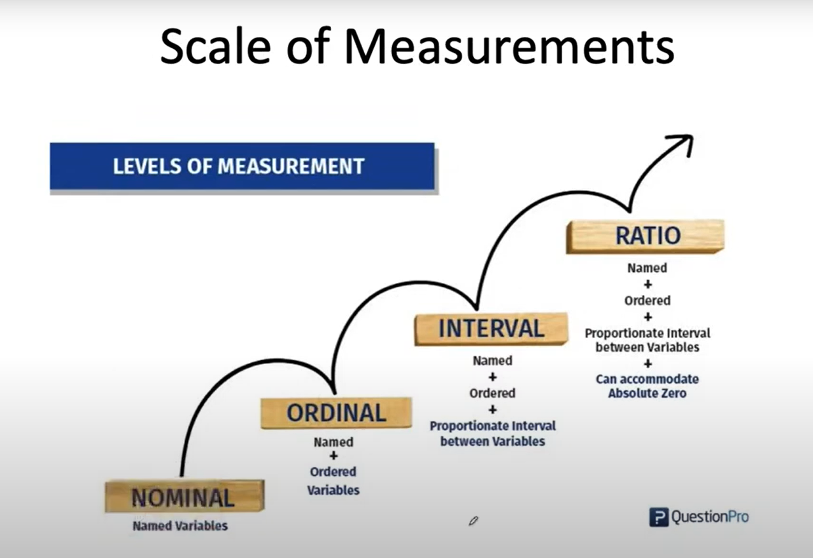
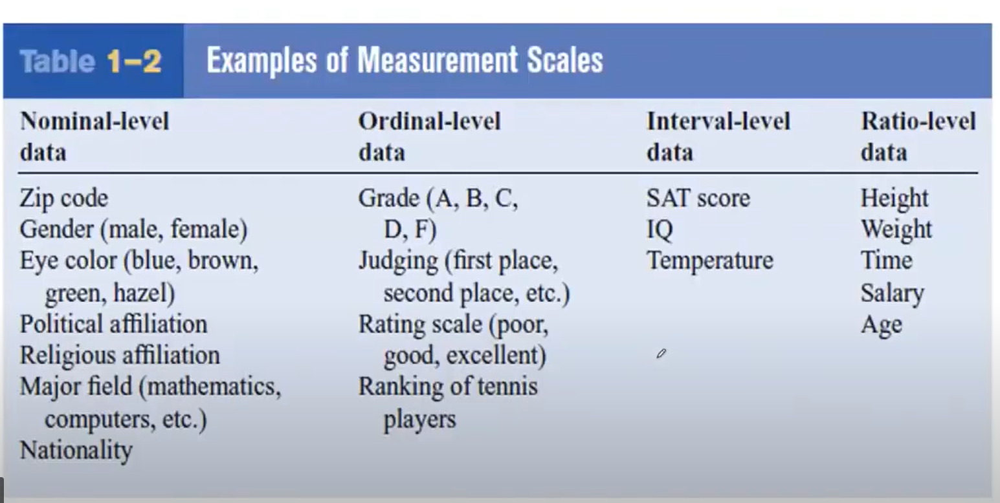

# Statistics
## Includes 3 Phases
1. Design and Planning
2. Descriptive 
3. Inferatial

## 1. Design and Planning
## df.info()
> Explains
* Scale of measurement
* Data type / variable type
* Types of study

1. Scale of measurement

2. Data type / Types of variable\
Variable-> Data
Data
    * Primary
    * Secondary

    1. Categorical
        *  Nominal -> categorical name
        *  Ordinal ->  categorical order

    2. Numerical
        * Continues -> floating number
        * Discrete ->  integer number

    3. Dependent and independent
        * Dependent -> outcome
        * Independent -> predictor

    4. Time series vs  cross sectional data
        * Time series -> data collected over time
        * Cross sectional -> data collected at one point in time

3.  Types of study
* Observational ->  data collected without intervention
* Experimental ->  cause and effect relationship or get insights from data

