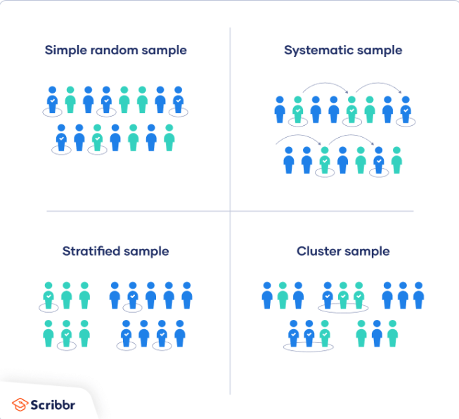
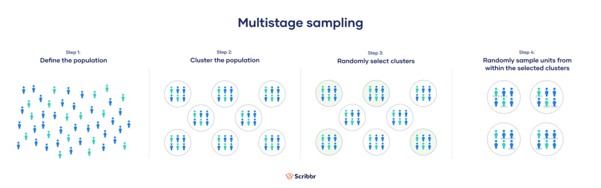
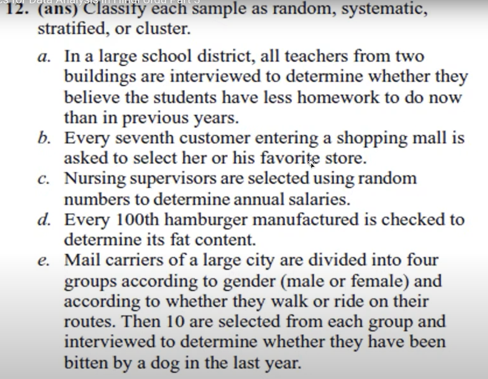
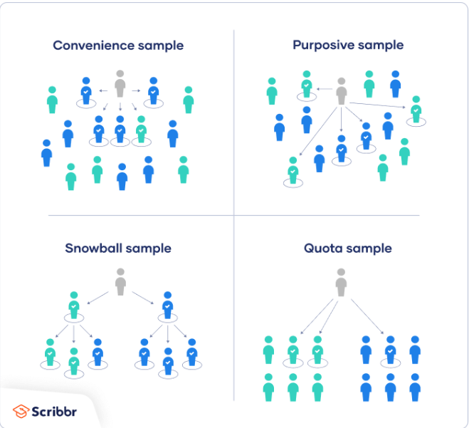

# Statistics

# Sampling Techniques
Sampling techniques are used to select a subset of the population for analysis.\
There are two main types of sampling techniques:\
* Probability sampling 
* non-probability sampling.

| S.No: | Probability | Non-Probability |
| --- | --- | --- |
1| Simple Random Sampling | Quota Sampling |
2| Stratified Random Sampling | Snowball Sampling |
3| Cluster Sampling |  Judgmental Sampling |
4| Systematic Sampling | Convinence Sampling |
5| Multistage Sampling | Purposive Sampling |

## Probability Sampling Techniques

### 1. Simple random sampling
In a simple random sample, every member of the population has an equal chance of being selected. Your sampling frame should include the whole population.

### 2. Systematic sampling
Systematic sampling is similar to simple random sampling, but it is usually slightly easier to conduct. Every member of the population is listed with a number, but instead of randomly generating numbers, individuals are chosen at regular intervals.

### 3. Stratified sampling
Stratified sampling involves dividing the population into subpopulations that may differ in important ways. It allows you draw more precise conclusions by ensuring that every subgroup is properly represented in the sample.

### 4. Cluster sampling
Cluster sampling also involves dividing the population into subgroups, but each subgroup should have similar characteristics to the whole sample. Instead of sampling individuals from each subgroup, you randomly select entire subgroups.

### 5. Multistage sampling
Multistage sampling is often considered an extended version of cluster sampling.\
In multistage sampling, you divide the population into clusters and select some clusters at the first stage. At each subsequent stage, you further divide up those selected clusters into smaller clusters, and repeat the process until you get to the last step. At the last step, you only select some members of each cluster for your sample.

## Question on Probability Sampling

> Answers of above question\
a. Cluster\
b. Systematic\
c. Simple Random\
d. Systematic\
e. Multistage sampling

## Non-Probability Sampling Techniques

### 1. Convenience sampling
A convenience sample simply includes the individuals who happen to be most accessible to the researcher.\
This is an easy and inexpensive way to gather initial data, but there is no way to tell if the sample is representative of the population, so it can’t produce generalizable results. Convenience samples are at risk for both sampling bias and selection bias.

### 2. Voluntary response sampling
Similar to a convenience sample, a voluntary response sample is mainly based on ease of access. Instead of the researcher choosing participants and directly contacting them, people volunteer themselves (e.g. by responding to a public online survey).\
Voluntary response samples are always at least somewhat biased, as some people will inherently be more likely to volunteer than others, leading to self-selection bias.

### 3. Purposive sampling
This type of sampling, also known as judgement sampling, involves the researcher using their expertise to select a sample that is most useful to the purposes of the research.\
It is often used in qualitative research, where the researcher wants to gain detailed knowledge about a specific phenomenon rather than make statistical inferences, or where the population is very small and specific. An effective purposive sample must have clear criteria and rationale for inclusion. Always make sure to describe your inclusion and exclusion criteria and beware of observer bias affecting your arguments.

### 4. Snowball sampling
If the population is hard to access, snowball sampling can be used to recruit participants via other participants. The number of people you have access to “snowballs” as you get in contact with more people. The downside here is also representativeness, as you have no way of knowing how representative your sample is due to the reliance on participants recruiting others. This can lead to sampling bias.

### 5. Quota sampling
Quota sampling relies on the non-random selection of a predetermined number or proportion of units. This is called a quota.\
You first divide the population into mutually exclusive subgroups (called strata) and then recruit sample units until you reach your quota. These units share specific characteristics, determined by you prior to forming your strata. The aim of quota sampling is to control what or who makes up your sample.